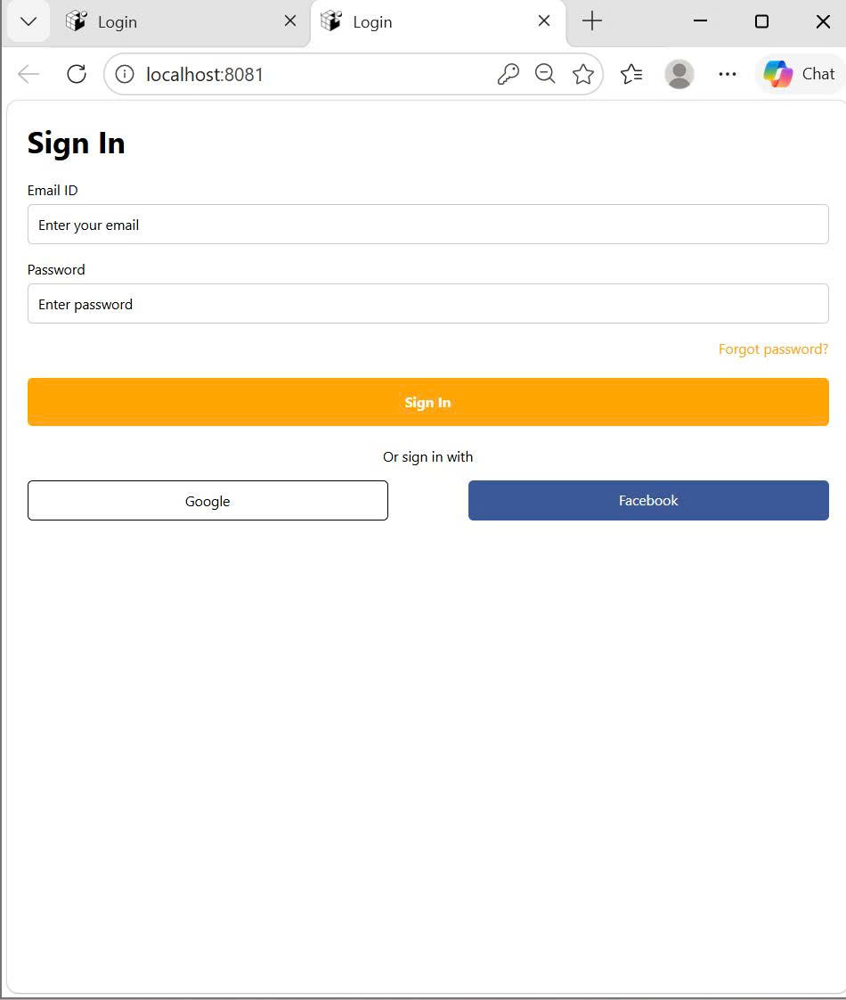
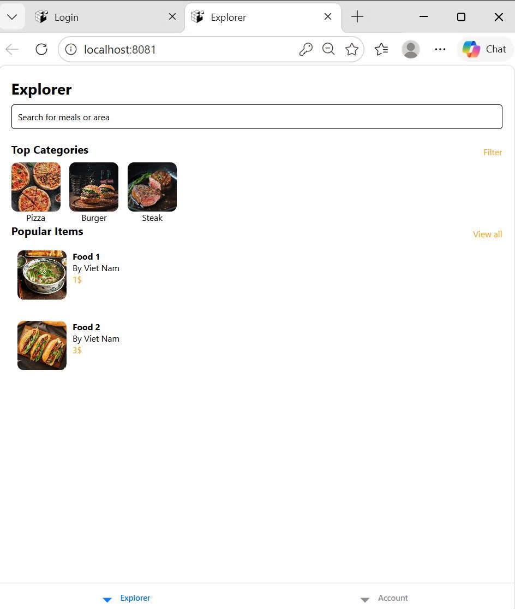
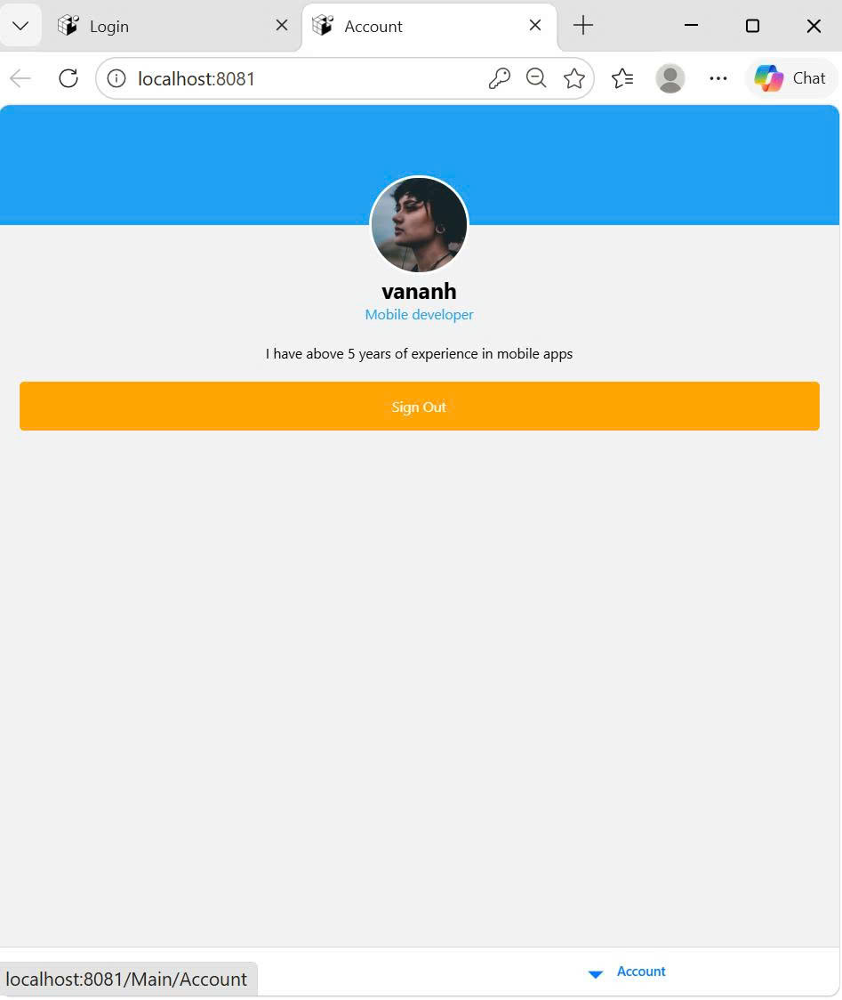

## 📌 Thông tin sinh viên  
- Họ và tên: **Chu Thị Vân Anh**  
- MSV: **23810310295**  

---

##  Bài tập buổi 9  

### 🔹 Cách 2: AsyncStorage (Lưu trạng thái đăng nhập)

###  Ảnh 1

###  Ảnh 2

###  Ảnh 3
